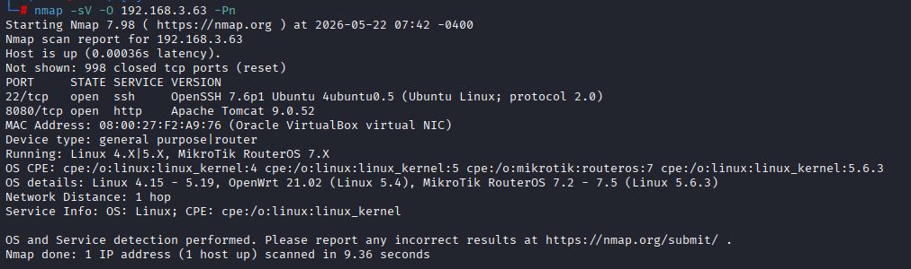
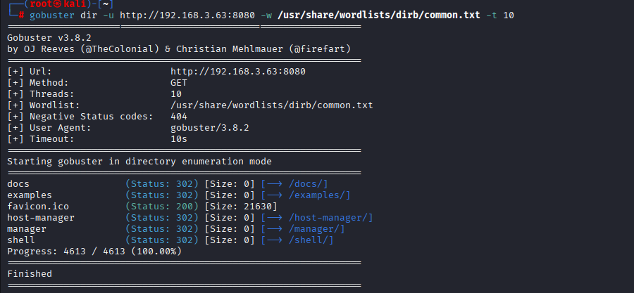
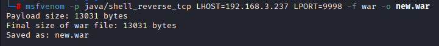
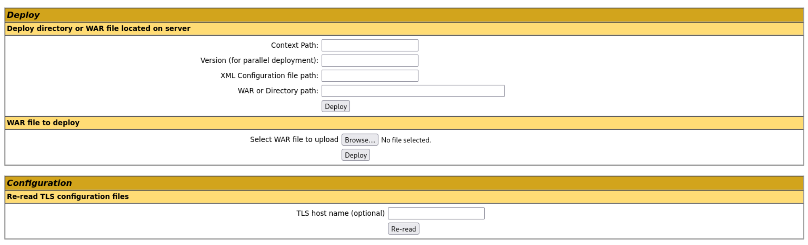
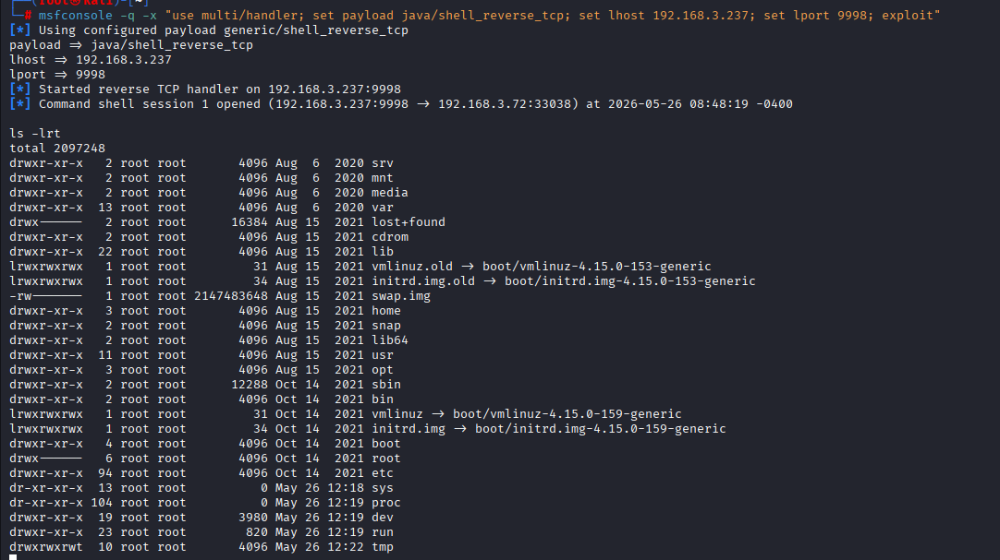
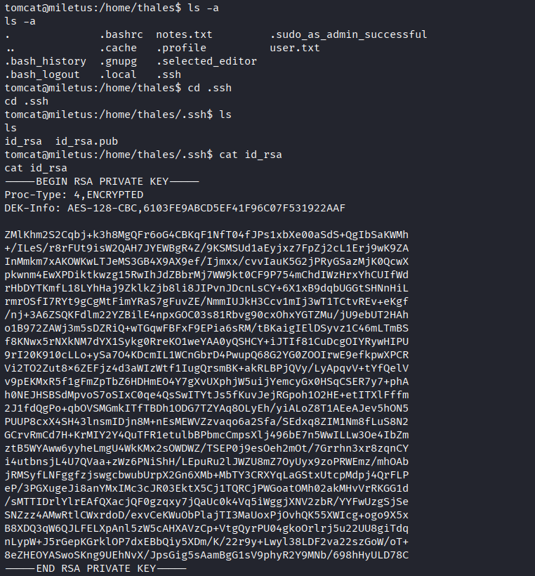
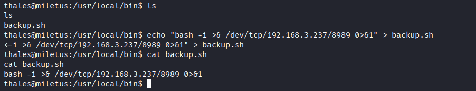
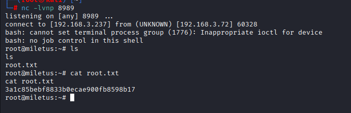

# Penetration Testing Lab Assessment

## Overview

This repository contains a penetration testing assessment performed
in a controlled educational lab environment as part of EnPT training
at Encryptecl Cyberguard.

The assessment followed a black-box penetration testing approach and
covered reconnaissance, service enumeration, authentication testing,
exploitation, post-exploitation, and privilege escalation.

## Assessment Scope

| Parameter | Details |
|---|---|
| Assessment Type | Black-Box Penetration Testing |
| Environment | Authorized Educational Lab |
| Target | Thales Virtual Machine |
| Methodology | Manual + Automated Testing |

## Objectives

- Identify exposed services and attack surface
- Enumerate reachable applications
- Assess authentication controls
- Identify weak credentials
- Validate exploitability
- Demonstrate remote code execution
- Perform post-exploitation enumeration
- Identify privilege escalation paths
- Document findings and remediation recommendations

## Attack Chain

```text
Reconnaissance
      ↓
Service Enumeration
      ↓
Apache Tomcat Discovery
      ↓
Tomcat Manager Discovery
      ↓
Credential Discovery
      ↓
Administrative Access
      ↓
WAR Deployment
      ↓
Remote Code Execution
      ↓
Reverse Shell
      ↓
SSH Key Discovery
      ↓
User Account Compromise
      ↓
Privilege Escalation
      ↓
Root Access
```

## Findings

| ID | Finding | Severity | CVSS |
|---|---|---|---:|
| F-01 | Service Enumeration | Low | 2.6 |
| F-02 | Exposed Tomcat Manager | High | 8.1 |
| F-03 | Weak Administrative Credentials | High | 8.8 |
| F-04 | Remote Code Execution via WAR Deployment | Critical | 9.8 |
| F-05 | User Account Compromise Through SSH Private Key | High | 8.1 |
| F-06 | Privilege Escalation Through backup.sh | Critical | 10.0 |

## Tools Used

- Nmap
- Gobuster
- Metasploit Framework
- MSFVenom
- ssh2john
- John the Ripper
- Netcat
- Kali Linux

## Key Takeaways

The assessment demonstrated how multiple security weaknesses can be chained together to achieve complete compromise of the target environment.

The primary weaknesses identified included:

- Exposed administrative interfaces
- Weak authentication controls
- Insecure application deployment
- Sensitive credential storage
- Improper privilege management

## Remediation

Key remediation measures included:

- Restrict administrative interfaces
- Rotate compromised credentials
- Remove unnecessary deployment capabilities
- Secure SSH private keys
- Apply least-privilege principles
- Review privileged script execution
- Implement centralized logging and monitoring

## Attack Evidence

### 1. Nmap Reconnaissance



### 2. Tomcat Manager Discovery



### 3. Payload Generation



### 4. WAR Deployment



### 5. Reverse Shell



### 6. SSH Key Compromise



### 7. Backup Script Exploitation



### 8. Privilege Escalation to Root



## Report

The complete penetration testing report is available in this repository.

[View the Full Penetration Testing Report](./Penetration-Testing-Report.pdf)

## Disclaimer

This assessment was performed in an authorized educational lab environment for learning and practical assessment purposes.

No unauthorized systems were targeted.

